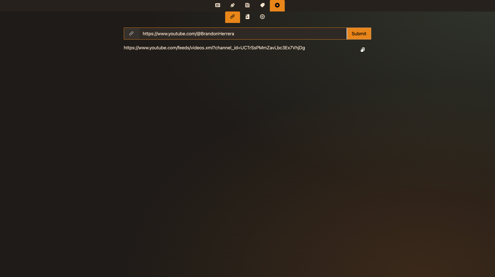
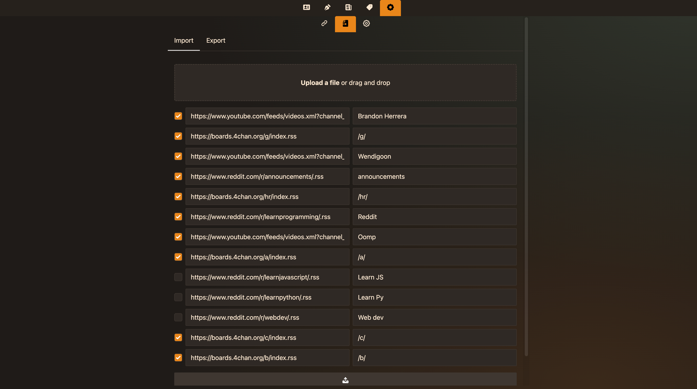
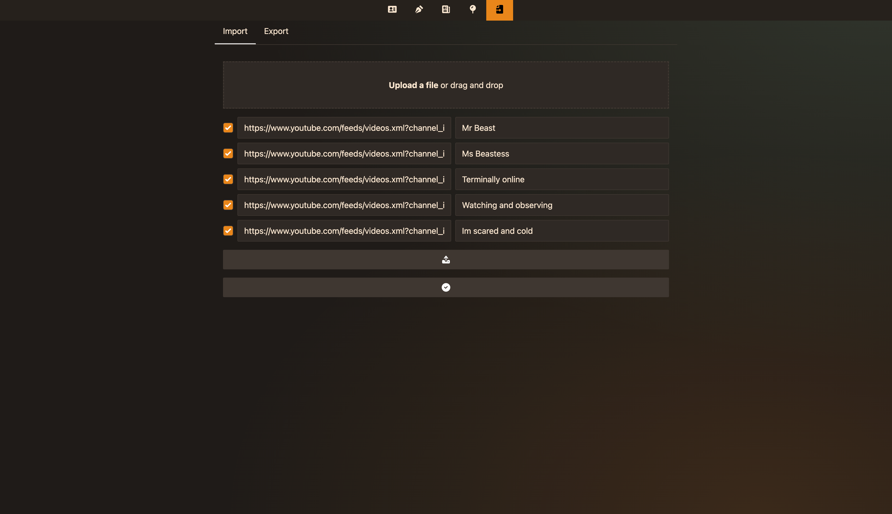

### Screenshots

### Features

- [x] add/remove feeds
- [x] view feeds you have added
- [x] export feeds
- [x] import feeds
- [x] mark feed items & view them
- [x] list available feeds added by other users
- [x] search feeds
- [ ] categorize feeds
- [ ] snapshot item as image
- [x] tool to fetch rss feeds from popular websites (e.g. reddit, youtube, etc.)
- [ ] settings menu to hide stuff like search bar, mark button, mark page, etc.
      **_... more to come ..._**

### Self-hosting

TODO: add instructions

> name inspired by [Archspire - Scream Feeding](https://www.youtube.com/watch?v=xg8OPdc0wI8) <3
